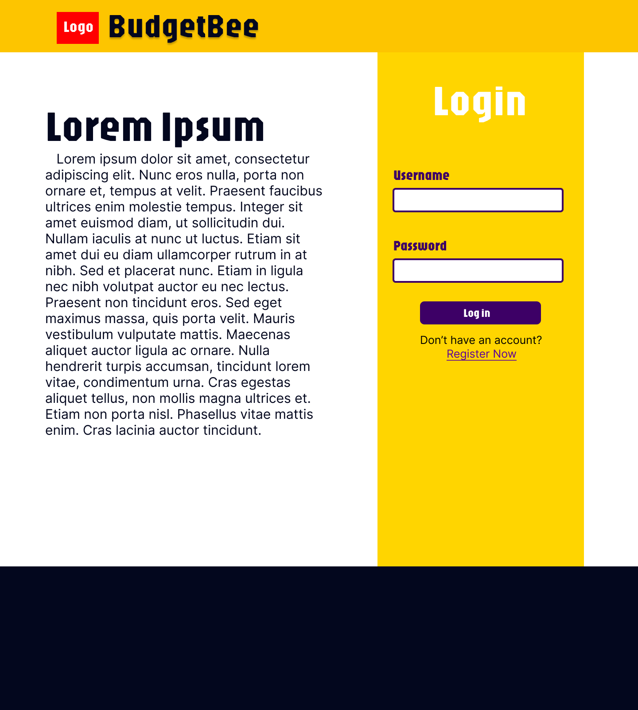
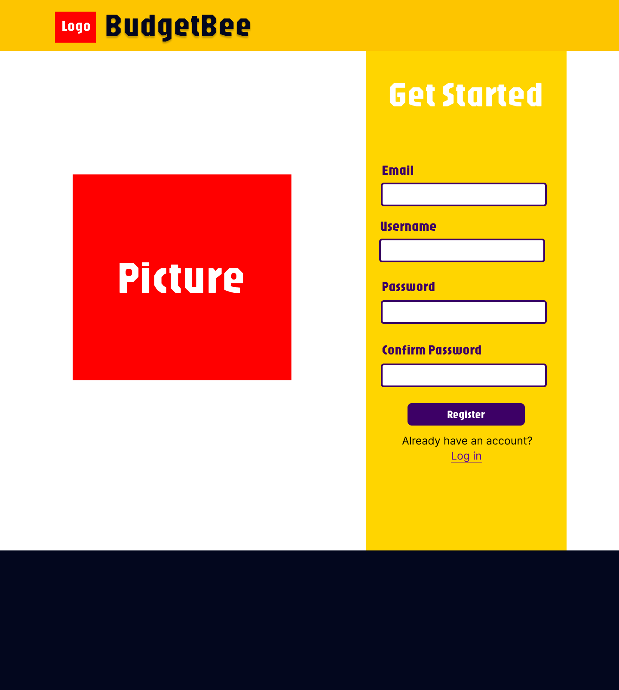
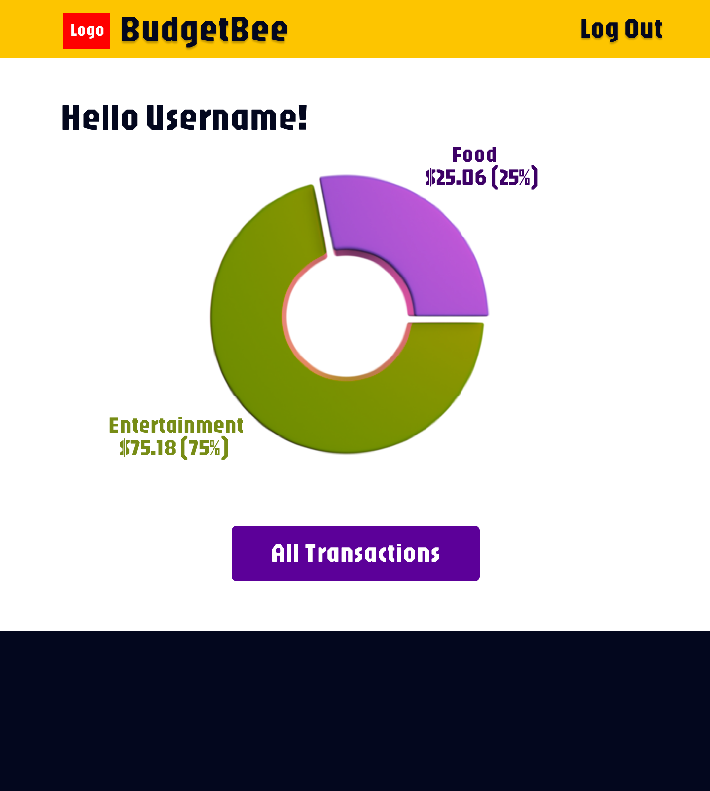
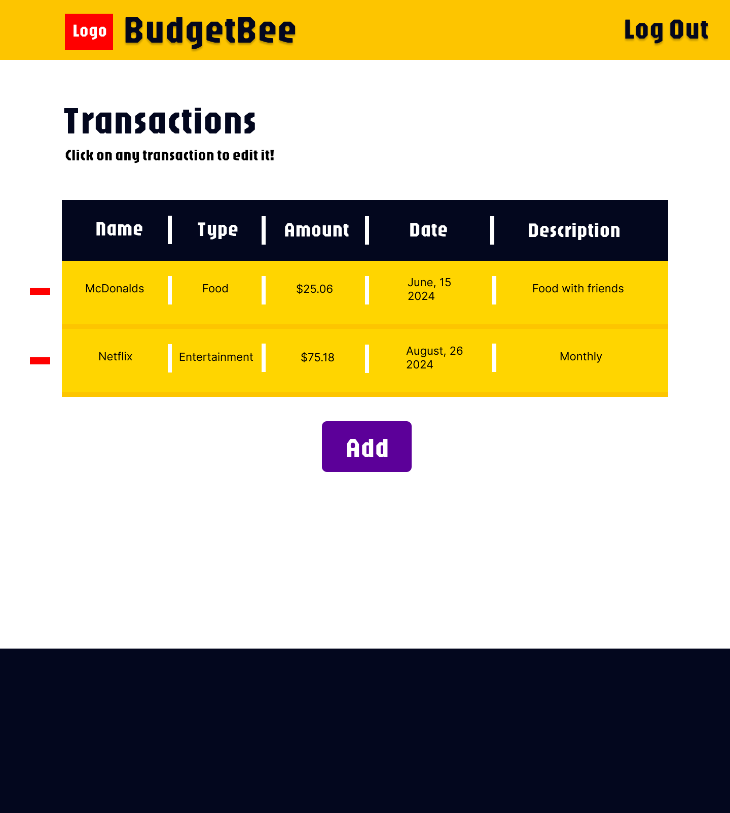
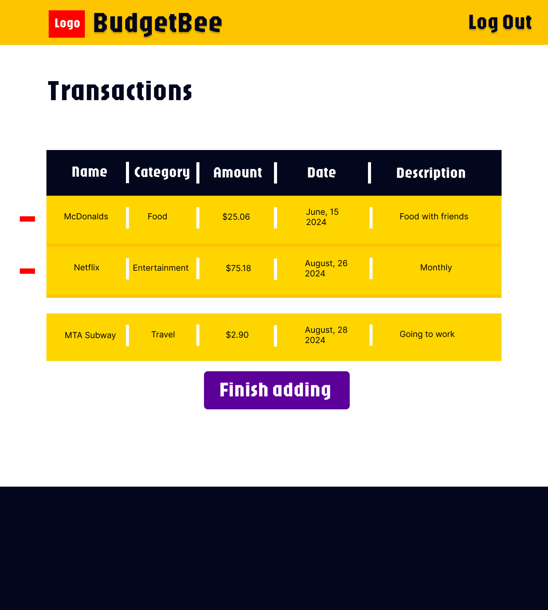
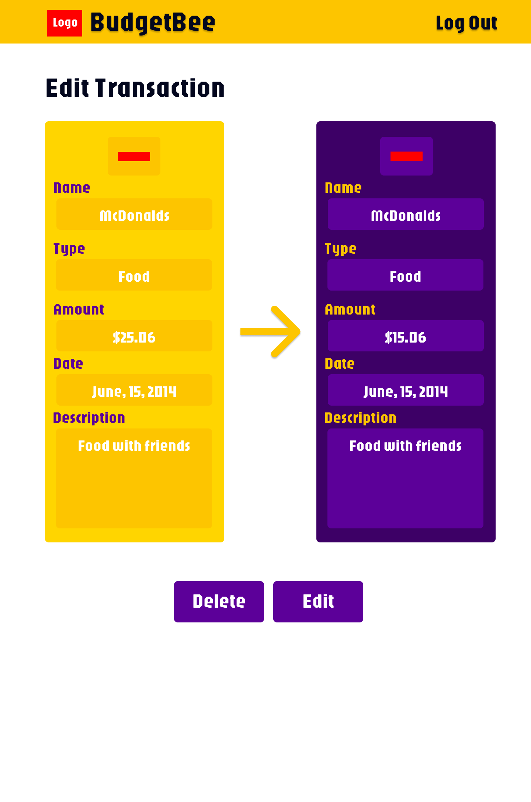

The content below is an example project proposal / requirements document. Replace the text below the lines marked "__TODO__" with details specific to your project. Remove the "TODO" lines.

(__TODO__: your project name)

# BudgetBee

## Overview

(__TODO__: a brief one or two paragraph, high-level description of your project)

BudgetBee is a web application that enables users to track and manage their finances in a simple, intuitive way. With BudgetBee, users can log income, record expenses across multiple categories, and view a summary of their spending habits. 

This application is designed to give users a clearer view of their financial health, helping them make informed decisions and manage their budgets and income.


## Data Model

(__TODO__: a description of your application's data and their relationships to each other) 

The application will store Users, Transactions, and Categories

* Users can add multiple transactions.
* Each transaction will belong to a specific category (e.g., "Food," "Transportation") to provide meaningful summaries and insights.

(__TODO__: sample documents)

An Example User:

```javascript
{
  username: "johndoe",
  passwordHash: //hash,
  email: "johndoe@example.com",
  createdAt: "2024-10-15T12:34:56Z"
}
```

An Example Transaction:

```javascript
{
  userId:  ,// a reference to a User object
  type: "expense",
  category: "Food",
  amount: 25.50,
  date: "2024-10-15T18:30:00Z", // Date object as string
  description: "Lunch with friends",
  createdAt: "2024-10-15T18:30:00Z"// Date object as string
}

```


## [Link to Commented First Draft Schema](db.mjs) 

(__TODO__: create a first draft of your Schemas in db.mjs and link to it)

## Wireframes

(__TODO__: wireframes for all of the pages on your site; they can be as simple as photos of drawings or you can use a tool like Balsamiq, Omnigraffle, etc.)

/login - page to log in



/register - page for registering



/dashboard - page showing an overview of finances (income, expenses, charts)



/transactions - page showing all transactions



/transaction/add - page for adding a new transaction



/transaction/add - page for editing a transaction



## Site map

(__TODO__: draw out a site map that shows how pages are related to each other)

Here's a [complex example from wikipedia](https://upload.wikimedia.org/wikipedia/commons/2/20/Sitemap_google.jpg), but you can create one without the screenshots, drop shadows, etc. ... just names of pages and where they flow to.

[Site map for BudgetBee](documentation/site-map.png)

## User Stories or Use Cases

(__TODO__: write out how your application will be used through [user stories](http://en.wikipedia.org/wiki/User_story#Format) and / or [use cases](https://en.wikipedia.org/wiki/Use_case))

1. As a new user, I can register an account with BudgetBee.
2. As a user, I can log in to the site.
3. As a user, I can add income or expenses and categorize them.
4. As a user, I can view a list of all my transactions.
5. As a user, I can see a summary of my financial data on a dashboard.

## Research Topics
* (3 points) Perform server side form validation using a JavaScript library
    * if you put in a value that's not valid, an error message will load
* (3 points) Data Visualization
  * Integrate charts (e.g., Chart.js) to visualize income and expense summaries.
  * This will add a visual component to the dashboard, helping users better understand their spending patterns.
* (2 points)  Motion One :
  * Adds subtle animations to enhance user experience, such as smooth transitions on row hovers, button clicks, or page transitions.
  * Make app feel more dynamic and responsive, adding a polished feel to the user interface.


8 points total out of 8 required points (___TODO__: addtional points will __not__ count for extra credit)


## [Link to Initial Main Project File](app.mjs) 


## Annotations / References Used

1. [Motion one](https://motion.dev/docs/quick-start)
2. [donut chart js chart.js] (https://www.chartjs.org/docs/latest/charts/doughnut.html#doughnut)

